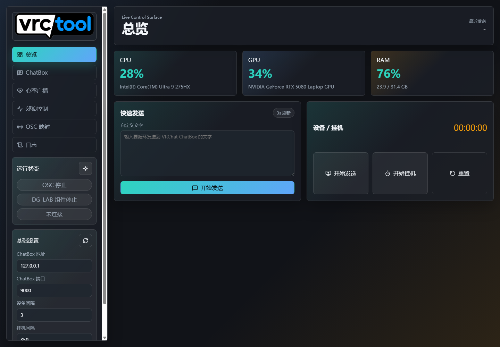
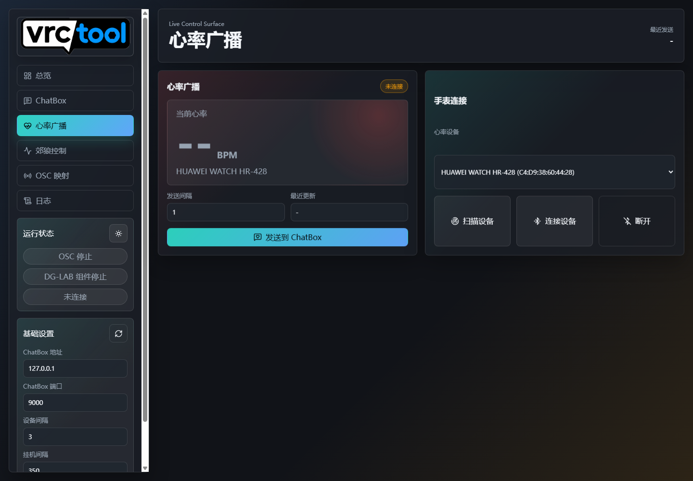
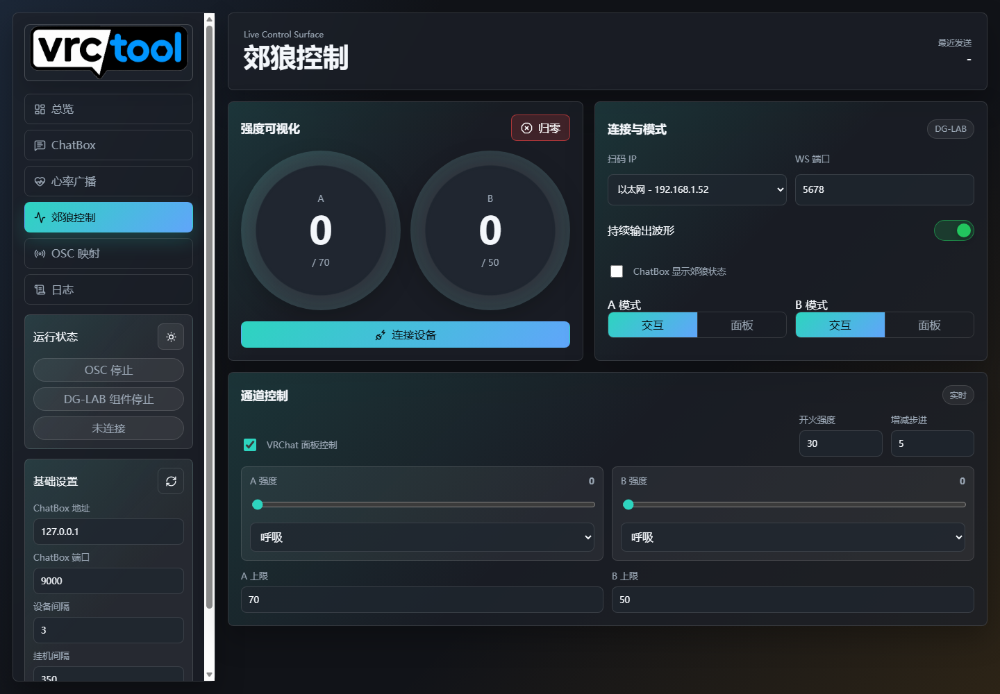
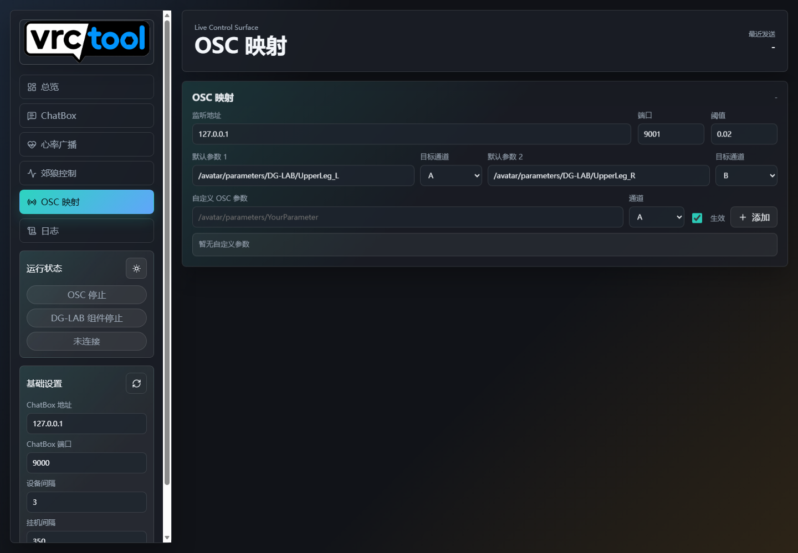

# vrctool

一个网页形式运行的 VRChat OSC 工具，集成 ChatBox 文本发送、硬件信息发送、挂机计时、DG-LAB 郊狼 3.0 WebSocket 联动和自定义 OSC 映射。

## 界面预览

| 总览 | 心率广播 |
| --- | --- |
|  |  |

| 郊狼控制 | OSC 映射 |
| --- | --- |
|  |  |

## 功能

- ChatBox 自定义文本循环发送：点击开始后立即发送，并每 3 秒刷新一次。
- ChatBox 硬件信息发送：CPU、GPU、显存、内存信息。
- ChatBox 挂机计时发送。
- 心率广播：扫描支持标准蓝牙 Heart Rate Service 的手表/心率带，实时读取 BPM 并发送到 VRChat ChatBox。
- DG-LAB 郊狼 3.0 WebSocket 连接：网页按钮弹出二维码，设备连接后自动切换为取消连接。
- DG-LAB A/B 通道强度、波形、上限、面板模式、交互模式控制。
- DG-LAB 状态发送到 VRChat ChatBox，更新时间为 1 秒。
- OSC 映射：支持默认 A/B 参数，也支持自定义 OSC 参数。
- 自定义 OSC 参数可选择 A、B、A+B 通道，并可用勾选框控制是否生效。
- 配置自动保存到 `config.json`，重启后继续生效。
- 启动器带单实例保护，重复打开时不会再启动第二套后端组件。
- 控制台式网页界面：左侧分区导航和基础设置，右侧任务工作区，支持浅色/深色主题切换。
- 郊狼强度环形可视化，会随 A/B 通道强度实时变化。

## 环境

- Windows 10/11
- Python 3.10 或更高版本
- VRChat 已开启 OSC
- 如需郊狼联动，需要 DG-LAB App 和郊狼 3.0 设备
- 如需心率广播，需要手表或心率带开启蓝牙心率广播模式

## 安装依赖

```powershell
python -m pip install -r requirements.txt
```

## 启动

双击 `run.bat`，或在 PowerShell 中运行：

```powershell
.\run.ps1
```

启动后会自动打开网页：

```text
http://127.0.0.1:8765
```

## 关闭

推荐直接关闭启动窗口，或在启动窗口按 `Ctrl+C`。

后端服务运行在启动器同一个进程里，窗口关闭时后端会一起退出，不会留下隐藏的 uvicorn 进程。

网页右上角也有关闭按钮，用它会请求启动器关闭后端服务。

## VRChat 设置

在 VRChat 中确认 OSC 已开启：

```text
Options -> OSC -> Enabled
```

默认监听：

```text
127.0.0.1:9001
```

ChatBox 默认发送到：

```text
127.0.0.1:9000
```

## DG-LAB 连接

1. 在网页 DG-LAB 分区选择扫码 IP 和 WS 端口。
2. 点击 `连接设备`。
3. 在弹窗中用 DG-LAB App 扫描二维码。
4. 连接成功后按钮会变成 `取消连接`。

强度上限会按照设备 WebSocket 返回的最大值限制，网页设置不会超过设备返回上限。

## 心率广播

1. 在手表或心率带上开启心率广播模式。
2. 打开网页 `心率广播` 分区。
3. 点击 `扫描设备`，选择你的心率设备。
4. 点击 `连接设备`，看到 BPM 后点击 `发送到 ChatBox`。

默认每 1 秒发送一次心率到 VRChat ChatBox，可在网页中调整发送间隔。该功能使用标准蓝牙 Heart Rate Service；如果设备没有开放标准心率服务，可能无法读取。

## OSC 映射

默认提供两条常用参数：

```text
/avatar/parameters/DG-LAB/UpperLeg_L
/avatar/parameters/DG-LAB/UpperLeg_R
```

这两条参数不固定绑定 A/B，可以在网页中分别选择目标通道 `A`、`B` 或 `A+B`。也可以继续添加自定义 OSC 参数，每条自定义参数都有 `生效` 勾选框，取消勾选后该参数不会触发郊狼强度。

## 配置文件

运行后会在程序目录生成：

```text
config.json
```

这个文件保存端口、OSC 映射、DG-LAB 设置、ChatBox 文本、心率设备地址等本地配置。它是本机配置文件，不会提交到 Git 仓库。

## 打包 EXE

项目不再保留固定的 `build_exe.bat` 或 `build_exe.ps1` 打包脚本。

需要打包时按版本号生成一次性 PyInstaller 命令，输出文件名形如：

```text
dist\vrctool_v2.1.exe
```

`vrctool_app/assets/logo.png` 会作为网页 Logo，也会在打包时转换为 exe 图标。

默认打包为控制台 exe。关闭 exe 窗口时，后端服务会一起关闭。

## 项目结构

```text
vrctool_app/
  launcher.py           启动器，负责窗口生命周期和打开网页
  server.py             FastAPI 后端接口
  single_instance.py    防止多开导致组件冲突
  chatbox.py            ChatBox 文本、设备信息、挂机计时发送
  dglab.py              DG-LAB WebSocket、强度、波形和二维码连接
  heartrate.py          蓝牙心率读取和 ChatBox 广播
  osc.py                VRChat OSC 监听和映射
  assets/               Logo 等资源
  web/                  网页前端
packaging/              PyInstaller 打包配置
references/legacy/      早期参考脚本
docs/images/            README 界面截图
requirements.txt        Python 依赖
run.bat / run.ps1       本地启动入口
```
